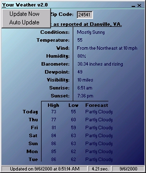



## Your Weather v2\.0 \*Contest Winner For August\*

### Description

I have made some upgrades to my project which was a contest winner for the month of August. This program gets your local and extended 6 day forecast as before. Now this program features a new and more unique GUI, a function to UPDATE at any given user interval, and docks to systray. Very well documented code. All around great app.
 
### More Info
 

             |
---                |---
**Submitted On**   |2000-09-06 08:53:52
**By**             |[Nathan](https://github.com/Planet-Source-Code/PSCIndex/blob/master/ByAuthor/nathan.md)
**Level**          |Intermediate
**User Rating**    |4.0 (12 globes from 3 users)
**Compatibility**  |VB 5\.0, VB 6\.0
**Category**       |[Complete Applications](https://github.com/Planet-Source-Code/PSCIndex/blob/master/ByCategory/complete-applications__1-27.md)
**World**          |[Visual Basic](https://github.com/Planet-Source-Code/PSCIndex/blob/master/ByWorld/visual-basic.md)
**Archive File**   |[CODE\_UPLOAD9675962000\.zip](https://github.com/Planet-Source-Code/nathan-your-weather-v2-0-contest-winner-for-august__1-11293/archive/master.zip)

